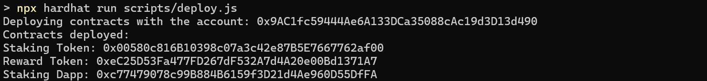
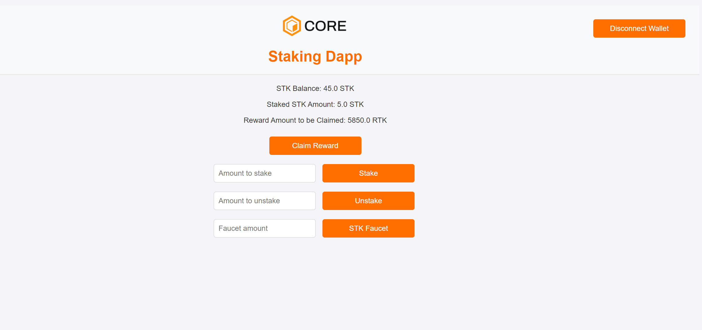
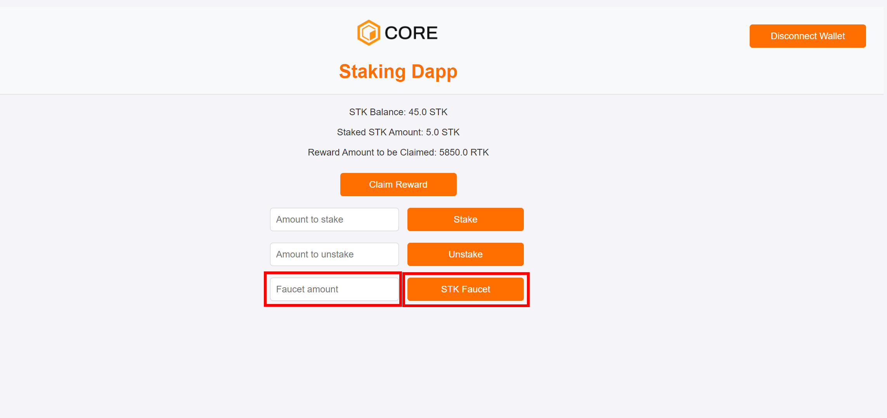
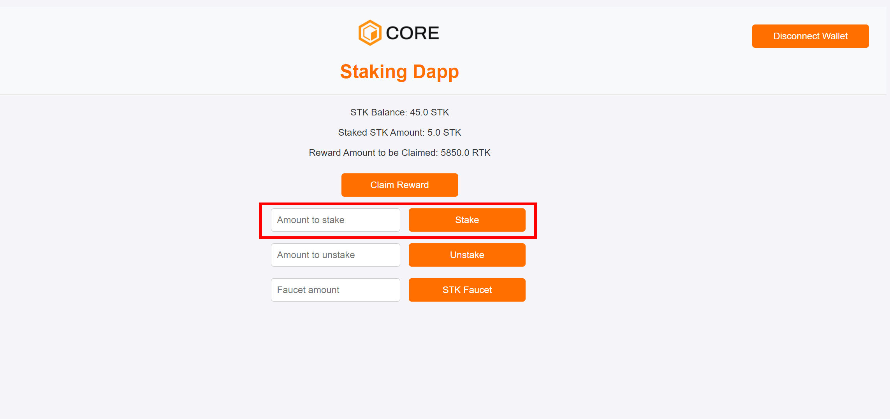
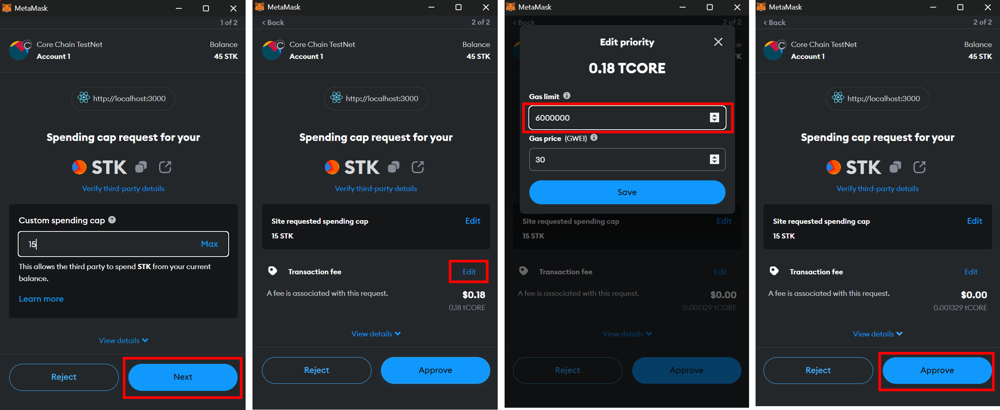
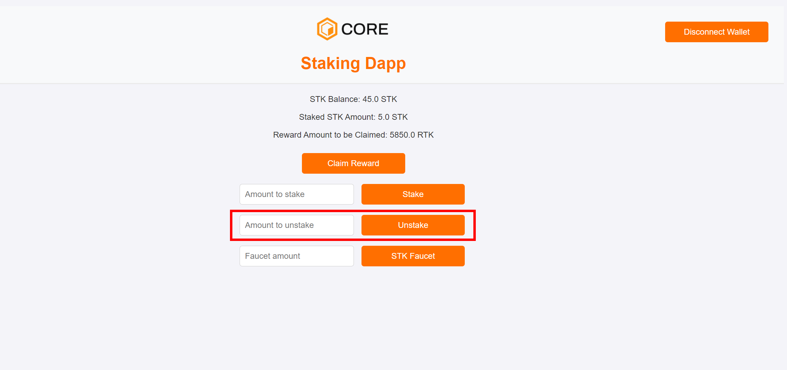

# Building a Staking Dapp on Core 

## What are we building
Welcome to this tutorial on building a simple staking dApp on the Core blockchain. In this guide, we'll walk through the process of creating a basic staking dApp that allows users to stake, unstake, and claim rewards. By the end of this tutorial, you'll have a functional dApp that interacts with smart contracts on the Core Testnet. 
In this staking dapp, 2 custom ERC20 tokens are used namely, `Staking Token - STK` and `Reward Token - RTK`. While, `STK` is used for staking, the `RTK` token is used for rewarding the users for staking their `STK` tokens.

## Learning Takeaways
* Smart Contract Development and deployment
* Building a frontend for integration with smart contracts
* Using Ethers.js library for communicating with smart contracts
* Integrating Metamask for secure user transactions and interactions
* Read and Write data to/from smart contracts

## Software Prerequisites 
* [Git](https://git-scm.com/) v2.44.0
* [Node.js](https://nodejs.org/en) v20.11.1
* [npm](https://docs.npmjs.com/downloading-and-installing-node-js-and-npm) v10.2.4
* [Hardhat](https://hardhat.org/hardhat-runner/docs/getting-started#installation) v2.22.6
* [MetaMask Web Wallet Extension](https://metamask.io/download/)Git v2.44.0
* **Core Testnet Configuration:** Configure MetaMask to connect to the Core Testnet. Refer [here](https://docs.coredao.org/docs/Dev-Guide/core-testnet-wallet-config#adding-core-testnet-to-metamask) for more details.
    * **Network Name:** Core Testnet
    * **New RPC URL:** https://rpc.test.btcs.network
    * **Chain ID:** 1115
    * **Currency Symbol:** CORE
* **Core Faucet:** To get test CORE tokens for transactions, visit the [Core Faucet](https://scan.test.btcs.network/faucet), refer [here]
(https://docs.coredao.org/docs/Dev-Guide/core-faucet) for more details.

## Setting up Dev Environment

### 1. Initialize the Project

```
mkdir staking-dapp
cd staking-dapp
npm init -y
npm install --save-dev hardhat
npx hardhat init 
```


### 2. Install and Configure MetaMask 
* Install and configure MetaMask Chrome Extension to use with Core Testnet. 
* Refer [here](https://docs.coredao.org/docs/Dev-Guide/core-testnet-wallet-config) for a detailed guide.

### 3. Create a Secret File
* Create a `secret.json` file in the root folder and store the private key of your MetaMask wallet in it. 
* Refer [here](https://metamask.zendesk.com/hc/en-us/articles/360015290032-How-to-reveal-your-Secret-Recovery-Phrase) for details on how to get MetaMask account's private key.

```json
{"PrivateKey":"you private key, do not leak this file, do keep it absolutely safe"}
```

> _Do not forget to add this file to the `.gitignore` file in the root folder of your project so that you don't accidentally check your private keys/secret phrases into a public repository. Make sure you keep this file in an absolutely safe place!_


### 4. Update .gitignore 
* Update your .gitignore file to ensure that your secret.json file and other sensitive files are not committed to version control.
* Make sure to add `secret.json` to the `.gitignore` file. 

```
node_modules
.env
secret.json

# Hardhat files
/cache
/artifacts

# TypeChain files
/typechain
/typechain-types

# solidity-coverage files
/coverage
/coverage.json

# Hardhat Ignition default folder for deployments against a local node
ignition/deployments/chain-31337
```

### 5. Update Hardhat.config 

Replace the contents of `hardhat.config.js` with the following configuration. Ensure that the network settings are configured correctly for Core Testnet.

```
/**
 * @type import('hardhat/config').HardhatUserConfig
 */

require('@nomiclabs/hardhat-ethers');
require("@nomiclabs/hardhat-waffle");

const { PrivateKey } = require('./secret.json');

module.exports = {
   defaultNetwork: 'core_testnet',

   networks: {
      hardhat: {
      },
      core_testnet: {
         url: 'https://rpc.test.btcs.network',
         accounts: [PrivateKey],
         chainId: 1115,
      }
   },
   solidity: {
      compilers: [
        {
           version: '0.8.24',
           settings: {
            evmVersion: 'paris',
            optimizer: {
                 enabled: true,
                 runs: 200,
              },
           },
        },
      ],
   },
   paths: {
      sources: './contracts',
      cache: './cache',
      artifacts: './artifacts',
   },
   mocha: {
      timeout: 20000,
   },
};
```

## Writing Smart Contracts
In the `contracts` folder, create the following smart contracts.

### Staking Token Contract
* For this dapp, we create a custom ERC20 token, named as `Staking Token - STK`. Users will stake their `STK` tokens to earn rewards.
* Create a `StakingToken.sol` file and udpate its contents with the following.

```js
// SPDX-License-Identifier: MIT
// Compatible with OpenZeppelin Contracts ^5.0.0
pragma solidity ^0.8.20;

import "@openzeppelin/contracts/token/ERC20/ERC20.sol";
import "@openzeppelin/contracts/access/Ownable.sol";
import "@openzeppelin/contracts/token/ERC20/extensions/ERC20Permit.sol";

contract StakingToken is ERC20, Ownable, ERC20Permit {
    constructor(string memory name, string memory symbol)
        ERC20(name, symbol)
        Ownable(msg.sender)
        ERC20Permit(name)
    {}

    function mint(address to, uint256 amount) public {
        require(amount <= 100 * 10 ** 18, "amount must be less than 100");
        _mint(to, amount);
    }
}
```

### Reward Token Contract
* For this dapp, we create a custom ERC20 token, named as `Reward Token - RTK`. Users will earn rewards as `RTK` tokens for staking their `STK` tokens.
* Create a `RewardToken.sol` file and udpate its contents with the following.

```js
// SPDX-License-Identifier: MIT
// Compatible with OpenZeppelin Contracts ^5.0.0
pragma solidity ^0.8.20;

import "@openzeppelin/contracts/token/ERC20/ERC20.sol";
import "@openzeppelin/contracts/access/Ownable.sol";
import "@openzeppelin/contracts/token/ERC20/extensions/ERC20Permit.sol";

contract RewardToken is ERC20, Ownable, ERC20Permit {
    constructor(string memory name, string memory symbol)
        ERC20(name, symbol)
        Ownable(msg.sender)
        ERC20Permit(name)
    {}

    function mint(address to, uint256 amount) public {
        _mint(to, amount);
    }
}
```

### Staking Dapp Contract 
* Create a `StakingDapp.sol` file and udpate its contents with the following.

```js 
// SPDX-License-Identifier: MIT
pragma solidity 0.8.24;

import "@openzeppelin/contracts/token/ERC20/IERC20.sol";
import "@openzeppelin/contracts/access/Ownable.sol";
import "@openzeppelin/contracts/token/ERC20/utils/SafeERC20.sol";

interface IRewardToken is IERC20 {
    function mint(address to, uint256 amount) external;
}

contract StakingDapp is Ownable {
    using SafeERC20 for IERC20;

    IERC20 public stakingToken;
    IRewardToken public rewardToken;

    struct Stake {
        uint256 amount;
        uint256 lastRewardTime; // Track the last time rewards were calculated
    }

    mapping(address => Stake) public stakes;
    mapping(address => uint256) public rewardBalance;

    uint256 public constant REWARD_AMOUNT = 5; // Reward tokens per interval
    uint256 public constant REWARD_INTERVAL = 10; // 10 seconds per reward interval

    event Staked(address indexed user, uint256 amount);
    event Unstaked(address indexed user, uint256 amount);
    event RewardClaimed(address indexed user, uint256 amount);

    constructor(address _stakingToken, address _rewardToken) Ownable(msg.sender) {
        require(_stakingToken != address(0) && _rewardToken != address(0), "Invalid token addresses");
        stakingToken = IERC20(_stakingToken);
        rewardToken = IRewardToken(_rewardToken);
    }

    function getStakedAmount(address user) external view returns (uint256) {
        return stakes[user].amount;
    }


    function stake(uint256 amount) external {
        require(amount > 0, "Amount must be greater than 0");
        
        if (stakes[msg.sender].amount > 0) {
            // Calculate and update reward balance before changing the stake
            uint256 pendingReward = calculateReward(msg.sender);
            rewardBalance[msg.sender] += pendingReward;
        }
        
        stakingToken.safeTransferFrom(msg.sender, address(this), amount);
        
        // Update the stake amount and last reward time
        stakes[msg.sender].amount += amount;
        stakes[msg.sender].lastRewardTime = block.timestamp;
        
        emit Staked(msg.sender, amount);
    }

    function unstake(uint256 amount) external {
        require(stakes[msg.sender].amount >= amount, "Insufficient balance");
        
        uint256 pendingReward = calculateReward(msg.sender);
        rewardBalance[msg.sender] += pendingReward;

        // Update the stake amount and last reward time
        stakes[msg.sender].amount -= amount;
        stakes[msg.sender].lastRewardTime = block.timestamp;
        
        stakingToken.safeTransfer(msg.sender, amount);
        
        emit Unstaked(msg.sender, amount);
    }

    function claimReward() external {
        uint256 reward = calculateReward(msg.sender) + rewardBalance[msg.sender];
        require(reward > 0, "No reward available");

        // Reset reward data
        rewardBalance[msg.sender] = 0;
        stakes[msg.sender].lastRewardTime = block.timestamp;
        
        // Mint reward tokens
        rewardToken.mint(msg.sender, reward);
        
        emit RewardClaimed(msg.sender, reward);
    }

    function calculateReward(address user) internal view returns (uint256) {
        Stake memory userStake = stakes[user];
        if (userStake.amount == 0) {
            return 0;
        }

        uint256 currentTime = block.timestamp;
        uint256 timeSinceLastReward = currentTime - userStake.lastRewardTime;
        uint256 intervalsPassed = timeSinceLastReward / REWARD_INTERVAL;
        // Calculate reward based on intervals passed and staked amount
        return intervalsPassed * REWARD_AMOUNT * userStake.amount; // 1e18; // Assumes REWARD_AMOUNT and staked amount are in the same decimal place
    }
    function getRewardAmount(address user) external view returns (uint256) {
        uint256 reward = calculateReward(user);
        return reward;
    }

}
```
#### Explanation
The StakingDapp contract is a basic implementation of a staking mechanism in Solidity. It allows users to stake an ERC20 token (stakingToken), earn rewards in another ERC20 token (rewardToken), and claim those rewards.

##### State Variables
* **stakingToken:** The ERC-20 token that users will stake.
* **rewardToken:** The ERC-20 token used to distribute rewards.
* **stakes:** A mapping from user addresses to their staking details, including the amount staked and the last time rewards were calculated.
* **rewardBalance:** A mapping to keep track of the reward balance for each user that they have accumulated but not yet claimed.
* **REWARD_AMOUNT:** The amount of reward tokens distributed per reward interval.
* **REWARD_INTERVAL:** The time interval (in seconds) between reward distributions.

##### Functions
1. **getStakedAmount(address user)**: Returns the amount of STK tokens staked by a user.

2. **stake(uint256 amount)**: Allows users to stake a specified amount of staking tokens.
    * Updates the user's reward balance before modifying the stake.
    * Transfers the tokens from the user to the contract.
    * Updates the staking details and the last reward calculation time.
    * Emits the Staked event.

3. **unstake(uint256 amount)**: Allows users to unstake a specified amount of stakingToken.
    * Ensures the user has sufficient staked tokens.
    * Updates the reward balance before modifying the stake.
    * Transfers the STK tokens back to the user.
    * Updates the staking details and the last reward calculation time.
    * Emits the Unstaked event.

4. **claimReward()**: Allows users to claim their accumulated rewards.
    * Calculates the total reward available for the user.
    * Mints the reward tokens and transfers them to the user.
    * Resets the user's reward balance.
    * Updates the last reward calculation time.
    * Emits the RewardClaimed event.

5. **calculateReward(address user)**: Calculates the reward amount for a user based on the time elapsed since the last reward calculation and the amount staked.
    * Uses the REWARD_AMOUNT and REWARD_INTERVAL to compute how many reward intervals have passed.
    * Calculates the total reward based on the number of intervals and the amount staked.
    * Visibility: Internal, used by other functions within the contract.

6. **getRewardAmount(address user)**: Allows anyone to query the amount of reward available for a specific user.

## Compile and Deploy Smart Contracts

### Compiling Smart Contracts
To compile the smart contracts, run the command `npx hardhat compile`

### Deploying Smart Contracts
* Create a `scritps` folder in the root of your project.
* Create a file `deploy.js` in the `scripts` folder.
* Update the contents of the `deploy.js` file with the following:

```js
const { ethers } = require("hardhat");

async function main() {
    const [deployer] = await ethers.getSigners();

    console.log("Deploying contracts with the account:", deployer.address);

    const StakingToken = await ethers.getContractFactory("StakingToken");
    const stakingToken = await StakingToken.deploy("Staking Token", "STK");

    const RewardToken = await ethers.getContractFactory("RewardToken");
    const rewardToken = await RewardToken.deploy("Reward Token", "RTK");

    const StakingDapp = await ethers.getContractFactory("StakingDapp");
    const stakingDapp = await StakingDapp.deploy(stakingToken.address, rewardToken.address);

    console.log("Contracts deployed:");
    console.log("Staking Token:", stakingToken.address);
    console.log("Reward Token:", rewardToken.address);
    console.log("Staking Dapp:", stakingDapp.address);
}

main()
    .then(() => process.exit(0))
    .catch((error) => {
        console.error(error);
        process.exit(1);
    });

```
* Make sure your MetaMask wallet has tCORE test tokens for the Core Testnet. Refer [here](https://docs.coredao.org/docs/Dev-Guide/core-faucet) for details on how to get tCORE tokens from Core Faucet. 

* Run the following command from the root directory of your project, to deploy smart contracts on the Core blockchain.

```bash
npx hardhat run scripts/deploy.js
```

* If succesfully deployed, you will get the following output



* Save the addresses for the deploed contracts for use with the frontend.

## Interacting with Smart Contract through Frontend

⚡️ Let's create a frontend interface for interacting with the smart contract.

### Setting up frontend 

* Create a simple react application using the following command

```bash
npx create-react-app frontend
cd frontend
```

* Install Dependencies, the Ethers.js library for communicating with the deployed smart contracts.

```bash
  npm install --save-dev ethers@5.6.9
```

* Create a `contracts` folder inside the `frontend/src` folder.

```bash
mkdir components 
mkdir contracts 
```

Copy the ABIs in the form of `.json` files, of your deployed smart contracts, from `artifacts/contracts/RewardToken.sol` `artifacts/contracts/StakingToken.sol` and `artifacts/contracts/RewardToken.sol` directories into the `frontend/src/contracts` directory.


* Create a `components` folder in the `frontend/src` directory. 
```bash 
mkdir components
cd components
```

### Adding Frontend Fuctionality
* Update the `App.js` with the contents of the [App.js](./frontend/src/App.js) in the boilerplate repo.
* Update the `App.css` with the contents of the [App.css](./frontend/src/App.css) in the boilerplate repo.
* Create a `Modal.js` file inside the `components` directory. Update the file with the contents of the [Modal.js](./frontend/src/components/Modal.js) in the boilerplate repo.
* Create a `Modal.css` file in the `components` directory. Update the file with the contents of the [Modal.csss](./frontend/src/components/Modal.css) in the boilerplate repo.

### Key Implementation
The application's key blockchain logic is implemented in [App.js](./frontend/src/App.js)

1. **App.js (Wallet):** Line#31 onwards is the logic for connecting the application to MetaMask wallet.
2. **App.js (Stake):** Line#180 is the logic to stake the STK tokens.
3. **App.js (Unstake):** Line#211 is the logic to unstake the STK tokens.
4. **App.js (Claim Reward):** Line#275 is the logic to claim the rewards as the RTK tokens.
5. **App.js (STK Faucet):** Line#311 is the logic for the faucet to get STK tokens.

### Adding Smart Contract Details 
* Paste this into Lines 12, 13, and 14 the addresses of the deployed contracts of StakingToken, RewardToken and StakingDapp.

```js
const stakingDappAddress = '0xAddress_of_Staking_Dapp_Contract';
const stakingTokenAddress = '0xAddreess_of_Staking_Token_Contract';
const rewardTokenAddress = '0xAddreess_of_Reward_Token_Contract'; 
```

### Testing Locally
* From the `frontend` directory, run the command `npm run start`
* Make sure that your MetaMask wallet is correctly installed and switched to Core Testnet as described in our [Core Testnet user guide](https://docs.coredao.org/docs/Dev-Guide/core-testnet-wallet-config). You'll also need to connect your MetaMask wallet to the local site.
* Navigate to `http://localhost:3000/` in your browser.



* Enter an amount less than 100 and click on the `STK Faucet` to get STK tokens.


* Enter an amount greater than 0 and less than or equal to your STK balance and click `Stake` to stake tokens. 


* On clicking the `Stake` button, Metamask notification will pop up, allow the stakingdapp contract to spend your STK tokens, then click next and on the next notificxation click on `Edit` and give a higher gas limiti value, say 6000000, then click save and approve the transaction.

* Enter an amount greater than 0 and less than or equal to your staked balance and click `Unstake` to unstake tokens. 



## 🎉 **Congratulations!** 
You've just interacted with your deployed contract using your dApp's front end! You can build on the codebase by adding new UI components or more functionality to the staking dapp.


## 🔄 Updates

The following updates were made to improve and maintain the Staking DApp project:

- **Hardhat Configuration Updated**: Modified the `hardhat.config.js` to reflect updated settings, including compiler versions and new chain configurations.
- **Deployment to Latest Core Testnet**: Contracts were successfully deployed to the latest Core Testnet with **Chain ID 1114**.
- **Frontend Integration**: The frontend logic was updated to interact with the **latest deployed contract address** on Chain ID 1114.

## What are we building
...
