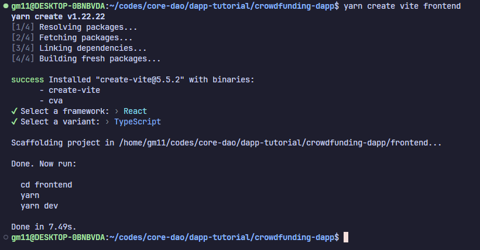
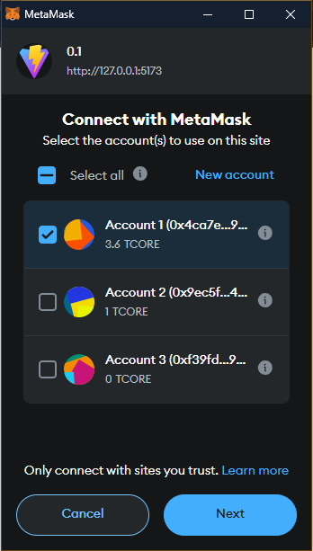
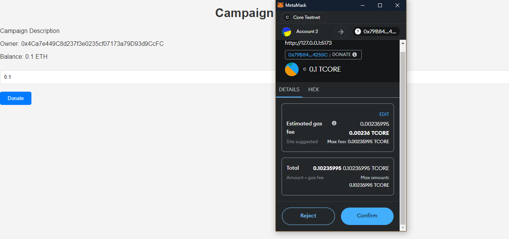
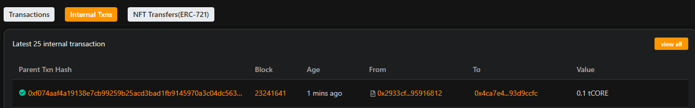

# Building Crowdfunding DApp on Core

Welcome to this tutorial where we will build a simple Crowdfunding DApp on Core Blockchain from scratch. We will make a basic DApp where you will be able to create campaigns and contribute to them. By the end of the tutorial, we will have a functional dapp that interacts with smart contracts on the Core Blockchain Testnet. Let’s start🙌

## Learning Takeaways

- Smart Contract Development in Solidity programming language
- Building frontend using React.js
- Using Ethers.js library for interaction of frontend with smart contracts
- Integrating Metamask wallet for secure user transactions
- Read and write data to/from smart contracts

## Software Prerequisites

- [Git](https://git-scm.com/)
- [Node.js](https://nodejs.org/en) v20.13.1
- [Yarn](https://yarnpkg.com/) v1.22.21
- [Foundry](https://book.getfoundry.sh/getting-started/installation)
- [Metamask Wallet](https://metamask.io/download/)
- **Core Testnet Configuration**: Configure MetaMask to connect to the Core Testnet. Refer here for more details.
  - **Network Name**: Core Testnet
  - **New RPC URL**: [https://rpc.test.btcs.network](https://rpc.test.btcs.network)
  - **Chain ID**: 1115
  - **Currency Symbol**: CORE
- **Core Faucet**: To get test CORE tokens for transactions, visit the Core Faucet, refer [here](https://docs.coredao.org/docs/Dev-Guide/core-faucet) for more details.

## Setting up Dev Environment

### 1. Initialize project

We will create a new project with the name `crowdfunding-dapp`.

```bash
forge init crowdfunding-dapp
```


### 2. Writing Smart Contracts

Now navigate to the project directory and create a new Solidity file called `Campaign.sol` in the `src` directory.

```js
// SPDX-License-Identifier: MIT
pragma solidity ^0.8.26;

contract Campaign {
    address public owner;
    string public title;
    string public description;

    constructor(string memory _title, string memory _description) {
        owner = msg.sender;
        title = _title;
        description = _description;
    }

    function contribute() public payable {
        require(msg.value > 0, "Contribution must be greater than 0");
        (bool success, ) = payable(address(this)).call{value: msg.value}("");
        require(success, "Failed to send funds");
    }

    function withdraw() public payable {
        require(msg.sender == owner, "Only owner can withdraw funds");
        payable(msg.sender).transfer(address(this).balance);
    }
}

```

In this contract, we:

- Define a contract named `Campaign`
- Declare state variables for the campaign's owner, title, and description
- Implement a constructor to initialize the campaign with a title and description
- Implement a `contribute` function that allows users to contribute to the campaign by sending ETH
- Implement a `withdraw` function that allows the campaign owner to withdraw the funds raised

Now create another file called `CampaignFactory.sol` in the `src` directory.

```js
// SPDX-License-Identifier: MIT
pragma solidity ^0.8.26;

import "./Campaign.sol";

contract CampaignFactory {
    address[] public campaigns;

    function createCampaign(string memory title, string memory description) public {
        Campaign newCampaign = new Campaign(title, description);
        campaigns.push(address(newCampaign));
    }

    function getCampaigns() public view returns (address[] memory) {
        return campaigns;
    }
}
```

In this contract, we:

- Define a contract named `CampaignFactory`
- Implement a `createCampaign` function that creates a new `Campaign` contract and adds its address to the `campaigns` array
- Implement a `getCampaigns` function that returns all the addresses of the created campaigns.

Now let's build our smart contracts to make sure there are no errors.


We can also test our smart contracts using Foundry. Create a new file called `CampaignFactory.t.sol` in the `test` directory.

```js
/// SPDX-License-Identifier: MIT
pragma solidity ^0.8.26;

import {Test, console} from "../forge-std/Test.sol";

contract CampaignFactoryTest is Test {
    CampaignFactory public campaignFactory;

    function setUp() public {
        campaignFactory = new CampaignFactory();
    }

    function test_CreateCampaign() public {
        campaignFactory.createCampaign(
            "Test Campaign",
            "This is a test campaign"
        );
    }

    function test_GetCampaigns() public {
        campaignFactory.createCampaign(
            "Test Campaign",
            "This is a test campaign"
        );
        campaignFactory.createCampaign(
            "Test Campaign",
            "This is a test campaign"
        );

        address[] memory campaigns = campaignFactory.getCampaigns();
        assertEq(campaigns.length, 2);
        assertEq(campaigns[0], address(campaigns[0]));
        assertEq(campaigns[1], address(campaigns[1]));
    }
}
```


Perfect, our smart contracts are working perfectly. Now let's deploy them to the Core Testnet.

```bash
forge create --rpc-url https://rpc.test.btcs.network --legacy ./src/CampaignFactory.sol:CampaignFactory --private-key <YOUR_PRIVATE_KEY>
```


### 3. Writing Frontend

Perfect, our smart contract are working perfectly. Now let's build our frontend.
Run the `yarn create vite frontend` command and select `React` and `Typescript` for the project.



And then run these commands to install the dependencies.

```bash
cd frontend
yarn add ethers react-router-dom
```

Now let's write code to connect our metamask wallet in the `App.tsx` file.

```js
import { ethers } from 'ethers'
import { useState, useEffect } from 'react'

const contractAddress = "0x5FbDB2315678afecb367f032d93F642f64180aa3";  // replace your contract address

function App() {
  const [walletAddress, setWalletAddress] = useState<string>("");


  async function connectWallet() {
    const { ethereum } = window;
    if (!ethereum) {
      alert("Please install MetaMask!");
      return;
    }

    try {
      const [account] = await ethereum.request({
        method: "eth_requestAccounts",
      });
      setWalletAddress(account);
    } catch (error) {
      console.log("Error fetching network:", error);
    }
  }
  useEffect(() => {
    connectWallet();
  }, []);


  return (
    <div>
      {
        walletAddress ? (
          <p>
            Connected Address: <strong>{walletAddress}</strong>
          
          </p>
        ) : (
          <p>Please connect your wallet</p>
        )
      }
    </div>
  )
}

export default App

```

Now run `yarn dev` command in the frontend directory, open the app in your browser on `http://localhost:5173`. You should see your metamaks wallet prompt you to connect to the website.



Now add the input fields to create a new campaign.

```js

async function createCampaign() {
    try {
      const provider = new ethers.BrowserProvider(window.ethereum);
      const signer = await provider.getSigner();
      const contract = new ethers.Contract(contractAddress, CampaignFactory.abi, signer);
      const tx = await contract.createCampaign(title, description);
      await tx.wait();
      getAllCampaigns();

    } catch (error) {
      console.log("Error creating campaign:", error);
    }
  }

  // rest of code

    <h2>Create new campaign</h2>
    <input type="text" placeholder="Title" onChange={(e) => setTitle(e.target.value)} />
    <input type="text" placeholder="Description" onChange={(e) => setDescription(e.target.value)} />
    <button onClick={createCampaign}>Create</button>
    <p>Connected Address: <strong>{walletAddress}</strong></p>

```

Now lets create a new campaign and see if it is added to the list of campaigns.


Now you can see the list of campaigns created.


Now create new react component `Campaign.tsx`, and edit the `main.tsx` file to add this page to the routes.

`main.tsx`

```js
const router = createBrowserRouter([
  {
    path: '/',
    element: <App />,
  },
  {
    path: '/campaign/:campaignAddress',
    element: <Campaign />,
  },
])

createRoot(document.getElementById('root')!).render(
  <RouterProvider router={router} />
)

```

`Campaign.tsx`

```js
import { useParams } from 'react-router-dom'
import { useState, useEffect } from 'react'
import Campaign from "./abis/Campaign.json"
import ethers from 'ethers'

function CampaignPage() {
    const { campaignAddress } = useParams()

    const [title, setTitle] = useState<string>('')
    const [description, setDescription] = useState<string>('')
    const [funds, setFunds] = useState<number>()
    const [owner, setOwner] = useState<string>('')

    const [fundingAmount, setFundingAmount] = useState<number>(0)

    useEffect(() => {
        async function fetchCampaign() {
            if (!campaignAddress) return
            const provider = new ethers.BrowserProvider(window.ethereum)
            const campaignContract = new ethers.Contract(campaignAddress, Campaign.abi, provider)
            setTitle(await campaignContract.title())
            setDescription(await campaignContract.description())
            setOwner(await campaignContract.owner())
            setFunds(Number(await provider.getBalance(campaignAddress)) / (10 ** 18))
        }
        fetchCampaign()
    }, [])


    async function fundCampaign() {
        if (!campaignAddress) return
        try {
            const provider = new ethers.BrowserProvider(window.ethereum)
            const signer = await provider.getSigner()
            const campaignContract = new ethers.Contract(campaignAddress, Campaign.abi, signer)
            const tx = await campaignContract.fund({ value: ethers.parseEther(fundingAmount.toString()) })
            await tx.wait()
        } catch (error) {
            console.error(error)
        }
    }

    return (
        <div>
            <h1>{title}</h1>
            <h2>{description}</h2>
            <p>Funds: {funds}</p>
            <p>Owner: {owner}</p>
            <p>Campaign Address: {campaignAddress}</p>

            <input type="number" value={fundingAmount} onChange={(e) => setFundingAmount(Number(e.target.value))} />
            <button onClick={fundCampaign}>Fund Campaign</button>
        </div>
    )
}

export default CampaignPage

```

Edit the `App.tsx` file to add a link to the campaign page.

```js
<Link to={`/campaign/${campaign.campaignAddress}`} key={index}>

```

Now lets navigate to the campaign page and try funding the campaign with another wallet.



Nice, our campaign is successfully funded. Now lets add a withdraw function to the campaign page.
For this we need to check if the campaign owner is the one withdrawing the funds.

```js
 async function withdrawFunds() {
        if (!campaignAddress) return
        try {
            const provider = new ethers.BrowserProvider(window.ethereum)
            const signer = await provider.getSigner()

            if ((await signer.getAddress()).toLowerCase() !== owner.toLowerCase()) {
                alert("You are not the owner of this campaign")
                return
            }
            const campaignContract = new ethers.Contract(campaignAddress, Campaign.abi, signer)
            const tx = await campaignContract.withdraw()
            await tx.wait()
        } catch (error) {
            console.error(error)
        }
    }

```

Now lets add a button to the campaign page to withdraw the funds.

```js
<button onClick={withdrawFunds}>Withdraw Funds</button>
```

Now when we click the withdraw button, it will ask us to sign the transaction, after successful transaction the funds will be transferred back to the owner.
We can confirm this by checking the transaction in the core explorer.



## Conclusion

Wooho🙌🎉 We have successfully built a simple crowdfunding DApp on Core Blockchain.

Now of course, the UI is very basic and we can add many more features to it. We can also use a more sophisticated frontend framework like Next.js for a better user experience.

Till then, Happy coding and keep building 🚀🤘
