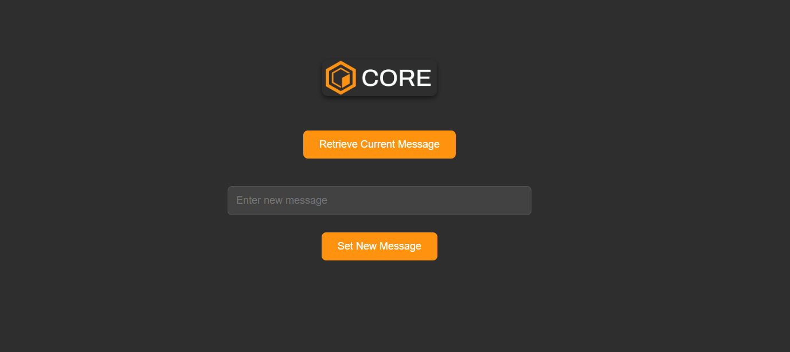

# Simple Hello World dApp on Core
In this tutorial, you'll learn how to build a simple decentralized application (dApp) using the Core blockchain TestNet. The focus will be on creating a "Hello World" dApp that interacts with a smart contract. This dApp will allow users to store, retrieve, and update a message on the blockchain. By following the steps in this guide, you will gain hands-on experience with MetaMask wallet integration, smart contract development, and front-end interaction using the Ethers.js library.
In this tutorial, we eill learn how to deploy a full simple decentralized application (dapp) on Telegram as a mini-dapp, which you can share with your contacts in-app to use.

## What Are We Building

In this tutorial, we will build a simple getter and setter dApp, which stores a message  in a smart contract deployed on the Core blockchain testnet. The dapp The dApp also has the functionality to retrieve and display the stored message. We are going to deploy the web application on telegram and we can use it as a mini app.

## Learning Takeaways
This tutorial will help you gain knowledge on the following learning points:

* MetaMask Wallet connectivity to Core Testnet;
* Smart contract development and deployment on Core Testnet;
* Front-end integration with the smart contract using Ethers.js library;
* Read data from a smart contract;
* Write data to a smart contract;
* Deploy on Telegram as a mini dapp

## Software Prerequisites
* [Git](https://git-scm.com/) v2.44.0
* [Node.js](https://nodejs.org/en) v20.11.1
* [npm](https://docs.npmjs.com/downloading-and-installing-node-js-and-npm) v10.2.4
* [Hardhat](https://hardhat.org/hardhat-runner/docs/getting-started#installation) v2.22.7
* [MetaMask Web Wallet Extension](https://metamask.io/download/)
* [Telegram App](https://metamask.io/download/)


We'd be using the already made dapp from the repo:, we'd just make some changes to utilize


## Running Your Application
* Start the React Development Server using the command `npm run dev`

```bash
npm run dev
Your application should now be accessible at http://localhost:5174.
```

## Interact with the dApp

Open your React app in the browser. You should be able to retrieve and set messages using your deployed contract.



## Deploying a Mini DApp on Telegram

This guide will walk you through hosting your web app and deploying it as a mini dApp on Telegram by connecting it to a bot.

### Prerequisites

- A frontend hosted on a platform like [Netlify](https://www.netlify.com/), [Vercel](https://vercel.com/), or [Fleek](https://fleek.co/).
- A Telegram account.

### Steps

1. **Host Your Web App**  
   First, deploy your web app using any of the following platforms:
   - [Netlify](https://www.netlify.com/)
   - [Vercel](https://vercel.com/)
   - [Fleek](https://fleek.co/)

   After successful deployment, you'll receive a domain link to your web app. Keep this URL handy for later.

2. **Create a Telegram Bot**
   - Open Telegram and search for [BotFather](https://t.me/BotFather).
   - Start a chat with BotFather and type the command:  
     `/newbot`
   - Follow the prompts to choose a **name** for your bot (e.g., `corebot`) and select a unique **username** (ending in `bot`).
   - Once the bot is created, you'll receive an **API token**. This token is used to interact with your bot via the HTTP API.

3. **Create a Mini App**
   - Type `/newApp` in the BotFather chat.
   - Select the bot you just created when prompted.
   - Provide a **description** of the mini app and upload an image with the required dimensions (640x360 pixels).
   - When asked to **link your web app**, copy the URL of your hosted web app and paste it in the BotFather chat.
   - Set a short name for the URL.

4. **Finalize and Launch**
   - Your mini app is now linked to your bot. You can open it directly in Telegram or in a web browser using the provided link.
   - Test the integration by interacting with the bot and accessing your web app through the Telegram mini app interface.


🎉 Congratulations! you've just deployed your dapp on telegram as a mini app. Users can easily share the link in-app and you could take it a step further into making it a mini game for people to play.


