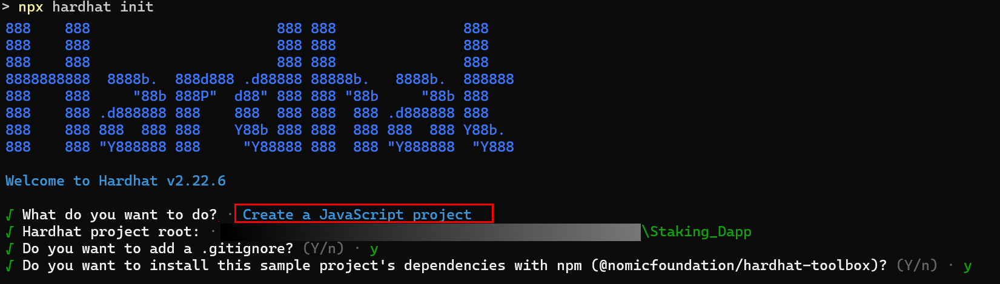
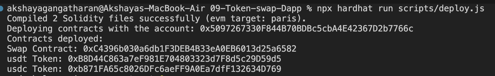
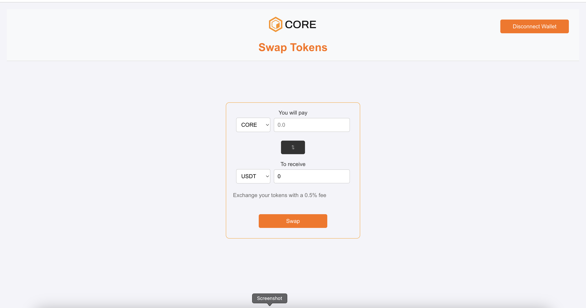
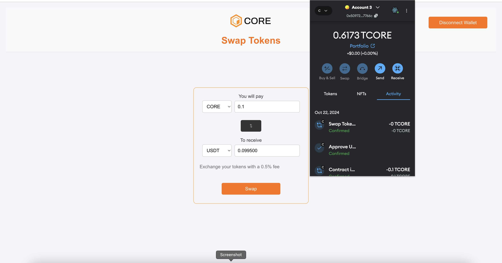
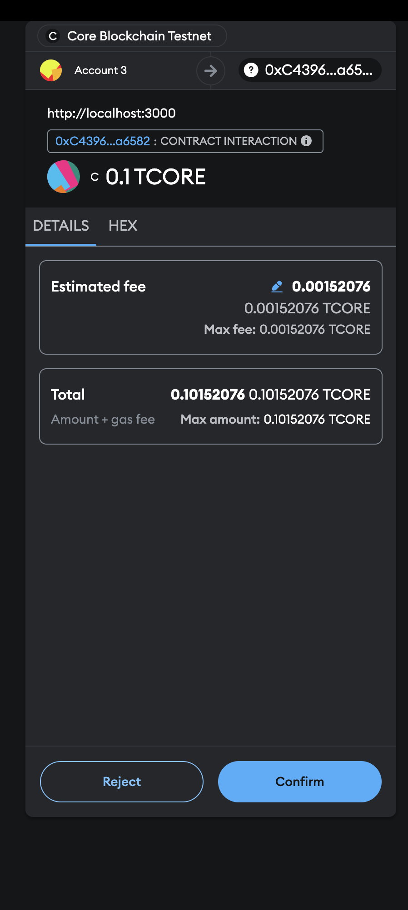
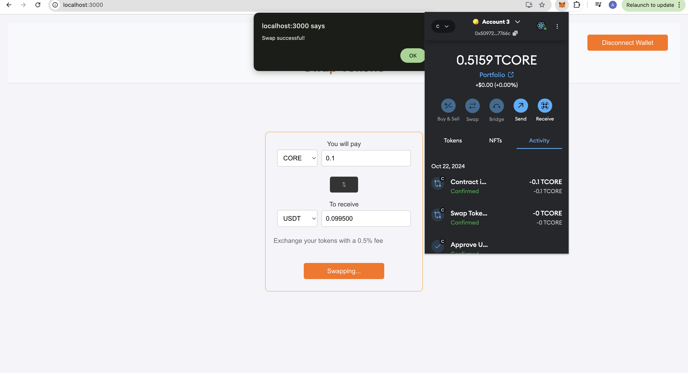
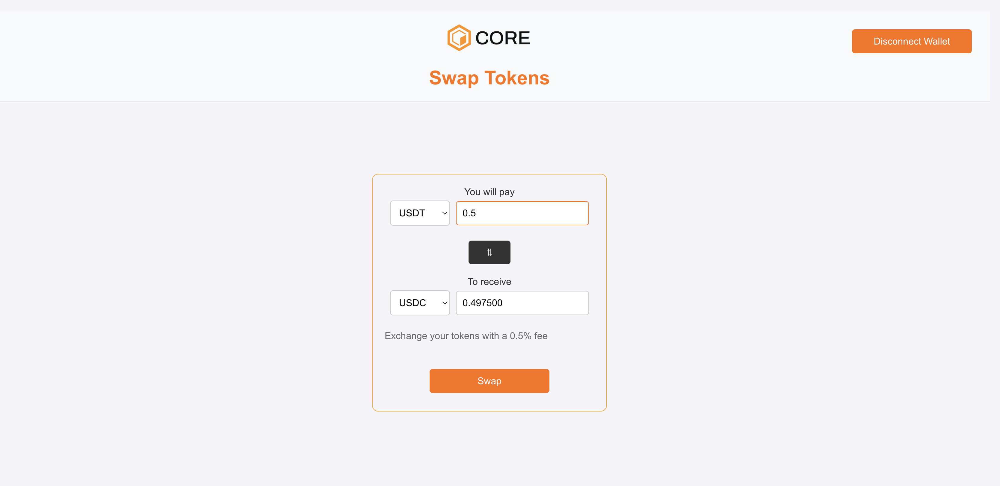
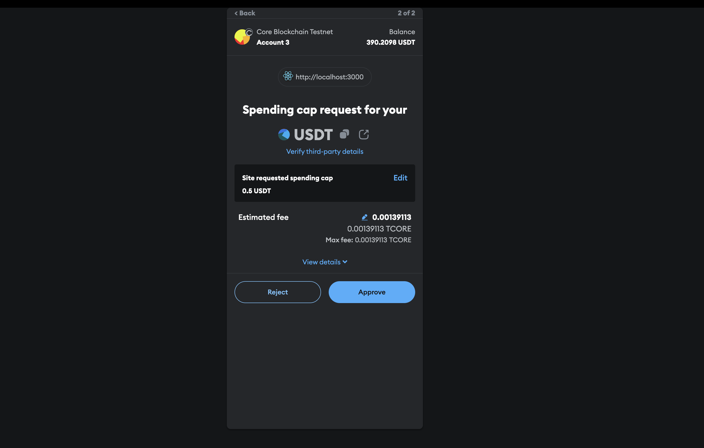
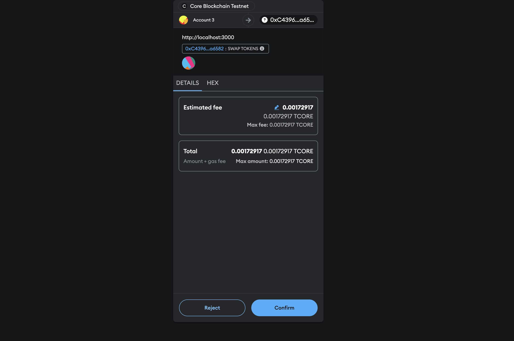

# Building a Token Swapping Dapp on Core

## What are we building

In this tutorial, we will guide you through building a simple token swapping decentralized application (dApp) on the Core blockchain. By the end of this guide, you will have a fully functional dApp that allows users to seamlessly swap between native tokens and ERC20 tokens directly on the Core Testnet.

This dApp will provide functionality for two types of swaps:

ERC20-to-ERC20 swaps: Users will be able to exchange custom ERC20 tokens, such as `Token A (USDC)` for `Token B (USDT)` and vice versa.
Native-to-ERC20 swaps: Users will also have the ability to swap `Core's native token (CORE)` with ERC20 tokens like `USDT` or `USDC`.

## Learning Takeaways

- Smart Contract Development and deployment
- Building a frontend for integration with smart contracts
- Using Ethers.js library for communicating with smart contracts
- Integrating Metamask for secure user transactions and interactions
- Read and Write data to/from smart contracts

## Software Prerequisites

- [Git](https://git-scm.com/) v2.44.0
- [Node.js](https://nodejs.org/en) v20.11.1
- [npm](https://docs.npmjs.com/downloading-and-installing-node-js-and-npm) v10.2.4
- [Hardhat](https://hardhat.org/hardhat-runner/docs/getting-started#installation) v2.22.6
- [MetaMask Web Wallet Extension](https://metamask.io/download/)Git v2.44.0
- **Core Testnet Configuration:** Configure MetaMask to connect to the Core Testnet. Refer [here](https://docs.coredao.org/docs/Dev-Guide/core-testnet-wallet-config#adding-core-testnet-to-metamask) for more details.
  - **Network Name:** Core Testnet
  - **New RPC URL:** https://rpc.test2.btcs.network
  - **Chain ID:** 1115
  - **Currency Symbol:** CORE
- **Core Faucet:** To get test CORE tokens for transactions, visit the [Core Faucet](https://scan.test2.btcs.network/faucet), refer [here]
  (https://docs.coredao.org/docs/Dev-Guide/core-faucet) for more details.

## Setting up Dev Environment

### 1. Initialize the Project

```
mkdir swap-token
cd swap-token
npm init -y
npm install --save-dev hardhat
npx hardhat init
```



### 2. Install and Configure MetaMask

- Install and configure MetaMask Chrome Extension to use with Core Testnet.
- Refer [here](https://docs.coredao.org/docs/Dev-Guide/core-testnet-wallet-config) for a detailed guide.

### 3. Create a Secret File

- Create a `secret.json` file in the root folder and store the private key of your MetaMask wallet in it.
- Refer [here](https://metamask.zendesk.com/hc/en-us/articles/360015290032-How-to-reveal-your-Secret-Recovery-Phrase) for details on how to get MetaMask account's private key.

```json
{
  "PrivateKey": "you private key, do not leak this file, do keep it absolutely safe"
}
```

> _Do not forget to add this file to the `.gitignore` file in the root folder of your project so that you don't accidentally check your private keys/secret phrases into a public repository. Make sure you keep this file in an absolutely safe place!_

### 4. Update .gitignore

- Update your .gitignore file to ensure that your secret.json file and other sensitive files are not committed to version control.
- Make sure to add `secret.json` to the `.gitignore` file.

```
node_modules
.env
secret.json

# Hardhat files
/cache
/artifacts

# TypeChain files
/typechain
/typechain-types

# solidity-coverage files
/coverage
/coverage.json

# Hardhat Ignition default folder for deployments against a local node
ignition/deployments/chain-31337
```

### 5. Update Hardhat.config

Replace the contents of `hardhat.config.js` with the following configuration. Ensure that the network settings are configured correctly for Core Testnet.

```
require("@nomicfoundation/hardhat-toolbox");
require("dotenv").config();

/** @type import('hardhat/config').HardhatUserConfig */
const PRIVATE_KEY = process.env.PRIVATE_KEY;

module.exports = {
  defaultNetwork: "hardhat",

  networks: {
    hardhat: {},
    core_testnet: {
      url: "https://rpc.test2.btcs.network",
      accounts: [PRIVATE_KEY],
      chainId: 1114,
     },
   },
   solidity: {
      compilers: [
        {
           version: '0.8.24',
           settings: {
            evmVersion: 'paris',
            optimizer: {
                 enabled: true,
                 runs: 200,
              },
           },
        },
      ],
   },
   paths: {
      sources: './contracts',
      cache: './cache',
      artifacts: './artifacts',
   },
   mocha: {
      timeout: 20000,
   },
};
```

## Writing Smart Contracts

In the `contracts` folder, create the following smart contracts.

### ERC20 Token Contract

- For this dapp, we create a custom ERC20 Token contract
- Create a `Token.sol` file in contracts folder and udpate its contents with the following.

```js
// SPDX-License-Identifier: MIT
pragma solidity ^0.8.24;

import "@openzeppelin/contracts/token/ERC20/ERC20.sol";
import "@openzeppelin/contracts/access/Ownable.sol";

contract Token is ERC20, Ownable {
    constructor(string memory _name, string memory _symbol)
        ERC20(_name, _symbol)
        Ownable(msg.sender)
    {
        _mint(msg.sender, 500 ether);
    }

    function mint(address to, uint256 amount) public onlyOwner {
        _mint(to, amount);
    }
}
```

### Swap Contract

- Create a `Swap.sol` file in contracts folder and udpate its contents with the following.

```js
// SPDX-License-Identifier: MIT
pragma solidity ^0.8.24;

import "@openzeppelin/contracts/token/ERC20/IERC20.sol";
import "@openzeppelin/contracts/access/Ownable.sol";

contract Swap is Ownable {
    address public feeCollector; // Address to collect fees
    uint32 public feePercent; // Fee percentage (in basis points, e.g., 50 = 0.5%)

    event TokensSwapped(
        address indexed user,
        address indexed tokenA,
        address indexed tokenB,
        uint256 amountIn,
        uint256 amountOut,
        uint256 fee
    );

    constructor(uint32 _feePercent) Ownable(msg.sender){
        require(_feePercent <= 10000, "Fee too high");
        feeCollector = msg.sender;
        feePercent = _feePercent;
    }

    // Swap ERC20 tokens
    function swapTokens(
        address tokenA,
        address tokenB,
        uint256 amountIn
    ) external {
        require(amountIn > 0, "AmountIn must be greater than 0");
        // Calculate fee
        uint256 fee = (amountIn * feePercent) / 10000;
        uint256 amountOut = amountIn - fee;

        require(IERC20(tokenB).balanceOf(address(this)) >= amountOut, "Insufficient tokenB for swap");

        // Transfer tokenA from sender to this contract
        IERC20(tokenA).transferFrom(msg.sender, address(this), amountIn);

        // Send fee to fee collector
        if (fee > 0) {
            IERC20(tokenA).transfer(feeCollector, fee);
        }

        // Transfer tokenB to the receiver
        IERC20(tokenB).transfer(msg.sender, amountOut);

        // Emit event for transparency
        emit TokensSwapped(msg.sender, tokenA, tokenB, amountIn, amountOut, fee);
    }

    // Swap native token (ETH) for ERC20 token
    function swapNativeForToken(address tokenB) external payable {
        require(msg.value > 0, "Amount must be greater than 0");
        uint256 amountIn = msg.value;
        uint256 fee = (amountIn * feePercent) / 10000;
        uint256 amountOut = amountIn - fee;

        require(IERC20(tokenB).balanceOf(address(this)) >= amountOut, "Insufficient token for swap");

        // Send fee to fee collector in native tokens
        if (fee > 0) {
            payable(feeCollector).transfer(fee);
        }

        // Transfer tokenB to the user
        IERC20(tokenB).transfer(msg.sender, amountOut);

        // Emit event for transparency
        emit TokensSwapped(msg.sender, address(0), tokenB, amountIn, amountOut, fee);
    }

    // Withdraw ERC20 tokens from the contract
    function withdrawTokens(address token, uint256 amount) external onlyOwner {
        require(IERC20(token).balanceOf(address(this)) >= amount, "Insufficient token balance");
        IERC20(token).transfer(msg.sender, amount);
    }

    // Withdraw native tokens from the contract
    function withdrawNative(uint256 amount) external onlyOwner {
        require(address(this).balance >= amount, "Insufficient ETH balance");
        payable(msg.sender).transfer(amount);
    }

    // Updates the fee percentage
    function updateFee(uint32 newFeePercent) public onlyOwner {
        require(newFeePercent <= 10000, "Fee too high");
        feePercent = newFeePercent;
    }
}

```

#### Explanation

The Swap.sol contract handles the swapping of tokens between ERC20 tokens and the native token (CORE) on the Core blockchain. Here's how it works:

##### State Variables

- **feeCollector:** This stores the address where the swap fees will be sent.
- **feePercent:** This determines the percentage of the fee deducted during each swap (e.g., 50 = 0.5%).

##### Functions

1. **swapTokens(address tokenA, address tokenB, uint256 amountIn)**:

   - Allows users to swap one ERC20 token (tokenA) for another ERC20 token (tokenB).
   - Fee is deducted from amountIn, and the remaining amount is transferred to the user.
   - Emits the TokensSwapped event.

2. **swapNativeForToken(address tokenB)**:

   - Allows users to swap the native blockchain token (CORE) for an ERC20 token (tokenB).
   - Accepts a msg.value in native tokens, deducts a fee, and transfers the remaining tokenB to the user.
   - Emits a TokensSwapped event.

3. **withdrawTokens(address token, uint256 amount)**: Allows the contract owner to withdraw any ERC20 tokens stored in the contract.

4. **withdrawNative(uint256 amount)**: Allows the owner to withdraw native tokens stored in the contract.

5. **updateFee(uint32 newFeePercent)**: Updates the fee percentage for the swaps, limited to a maximum of 10000 basis points (i.e., 100%).

## How the Swap Works:

1. Users provide the input token (tokenA) they want to swap and specify the token they want to receive (tokenB).

2. The contract calculates the fee, deducts it from the input amount, and transfers the output token (tokenB) to the user.

3. The fee is transferred to the fee collector (the contract owner by default).

## Compile and Deploy Smart Contracts

### Compiling Smart Contracts

To compile the smart contracts, run the command `npx hardhat compile`

### Deploying Smart Contracts

- Create a `scritps` folder in the root of your project.
- Create a file `deploy.js` in the `scripts` folder.
- Update the contents of the `deploy.js` file with the following:

```js
const { ethers } = require("hardhat");

async function main() {
  const [deployer] = await ethers.getSigners();

  console.log("Deploying contracts with the account:", deployer.address);

  const ERC20 = await ethers.getContractFactory("Token");
  const usdt = await ERC20.deploy("usdt", "USDT");
  const usdc = await ERC20.deploy("usdc", "USDC");

  const fee = 10;

  const Swap = await ethers.getContractFactory("Swap");
  const swap = await Swap.deploy(fee);

  console.log("Contracts deployed:");
  console.log("Swap Contract:", await swap.getAddress());
  console.log("usdt Token:", await usdt.getAddress());
  console.log("usdc Token:", await usdc.getAddress());

  const swapContractAddr = await swap.getAddress();

  await usdt.approve(swapContractAddr, ethers.parseEther("100"));
  await usdt.transfer(swapContractAddr, ethers.parseEther("100"));
  await usdc.approve(swapContractAddr, ethers.parseEther("100"));
  await usdc.transfer(swapContractAddr, ethers.parseEther("100"));
}

main()
  .then(() => process.exit(0))
  .catch((error) => {
    console.error(error);
    process.exit(1);
  });
```

- Make sure your MetaMask wallet has tCORE test tokens for the Core Testnet. Refer [here](https://docs.coredao.org/docs/Dev-Guide/core-faucet) for details on how to get tCORE tokens from Core Faucet.

- Run the following command from the root directory of your project, to deploy smart contracts on the Core blockchain.

```bash
npx hardhat run scripts/deploy.js
```

- If succesfully deployed, you will get the following output



- Save the addresses for the deployed contracts for use with the frontend.

## Interacting with Smart Contract through Frontend

⚡️ Let's create a frontend interface for interacting with the smart contract.

### Setting up frontend

- Create a simple react application using the following command

```bash
npx create-react-app frontend
cd frontend
```

- Install Dependencies, the Ethers.js library for communicating with the deployed smart contracts.

```bash
  npm install --save-dev ethers@5.7.2
```

- Create a `contracts` folder inside the `frontend/src` folder.

```bash
mkdir contracts
```

Copy the ABIs in the form of `.json` files, of your deployed smart contracts, from `artifacts/contracts/Token.sol` and `artifacts/contracts/Swap.sol` directories into the `frontend/src/contracts` directory.

### Adding Frontend Fuctionality

- Update the `App.js` with the contents of the [App.js](./frontend/src/App.js) in the boilerplate repo.
- Update the `App.css` with the contents of the [App.css](./frontend/src/App.css) in the boilerplate repo.

### Key Implementation

The application's key blockchain logic is implemented in [App.js](./frontend/src/App.js)

1. **App.js (Connect Wallet)**: Line #41 onwards is the logic for connecting the application to the MetaMask wallet, allowing users to interact with the blockchain.

2. **App.js (Check Network)**: Line #28 is the logic for checking if the user is connected to the Core Testnet. It alerts the user if they are connected to the wrong network.

3. **App.js (Calculate Output Amount)** : Line #62 is the logic for calculating the output amount based on the input amount and the fee percentage applied during the token swap.

4. **App.js (Swap Tokens)**: Line #150 is the logic for executing the token swap. It handles both native token swaps and ERC-20 token swaps, including approval of tokens and transaction handling.

### Adding Smart Contract Details

- Paste this into Lines 11, 12, and 15 the addresses of the deployed contracts of USDT, USDC and Swap Contract Address.

```js
const tokenAddresses = {
  CORE: "0x0000000000000000000000000000000000000000",
  USDT: "0xdBb5e35236536d38239102596adcaA5626e27bE2",
  USDC: "0x82fa6E5EDCE48bA4EBcA82dCDdec08d124d7Eed3",
};

const swapContractAddress = "0x8ac209ee5dfaC9c2D915f24edD34d4072059558b";
```

### Testing Locally

- From the `frontend` directory, run the command `npm run start`
- Make sure that your MetaMask wallet is correctly installed and switched to Core Testnet as described in our [Core Testnet user guide](https://docs.coredao.org/docs/Dev-Guide/core-testnet-wallet-config). You'll also need to connect your MetaMask wallet to the local site.
- Navigate to `http://localhost:3000/` in your browser.



#### Native to ERC-20 Token Transfer

- Click on `CORE` Input token and choose the output token `USDT` or `USDC`
- The Dapp automatically calculates the expected output amount based on the input amount, applying the defined fee percentage.
  

- After reviwing the swap Details, click on Swap and you need to confirm the transaction
  

- Once the transaction confirmed, you will see the swap successfull message and the balance has been updated
  

#### ERC20 to ERC-20 Token Transfer

- Click on `USDT` Input token and by default the output Amount will show `USDC`
- The Dapp automatically calculates the expected output amount based on the input amount, applying the defined fee percentage.
  

- After reviwing the swap Details, click on Swap and First you need to Approve and then confirm the transaction
  
  

- Once the transaction confirmed, you will see the swap successfull message

## 🎉 **Congratulations!**

You've just interacted with your deployed contract using your dApp's front end! You can build on the codebase by adding new UI components or more functionality to the Token Swap dapp.
