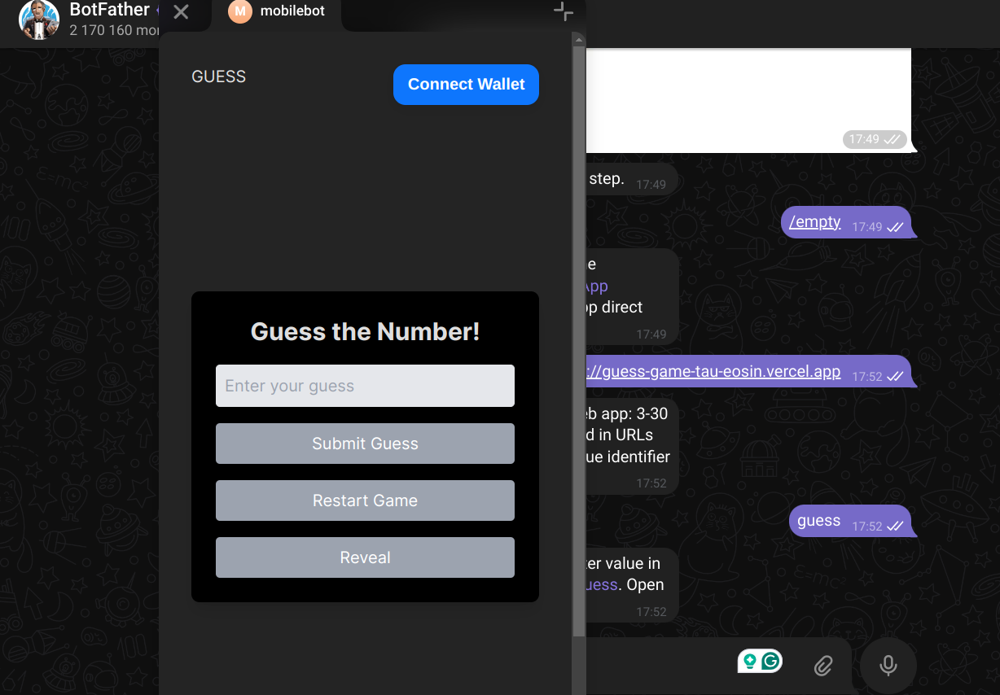

# Deploy a simple Guess the Number telegram mini DApp on Core Testnet

A decentralized application (DApp) that generates a random number between 1 and 10 on the blockchain. Users can connect their wallets, make guesses, and win if they guess the correct number.

## Table of Contents

1. [Smart Contract](#smart-contract)
   - Overview
   - Implementation
2. [Frontend](#frontend)
   - Overview
   - Setup
   - RainbowKit & Wagmi Integration
   - Game Logic
3. [Deploying on Core Chain](#deploying-on-core-chain)
   - Smart Contract Deployment
   - Frontend Deployment
4. [Running the DApp](#running-the-dapp)

5. [Hosting on Telegram as a Mini App](#deploying-on-core-chain)

---

## Smart Contract

### Overview

The smart contract is written in Solidity. It generates a random number between 1 and 10, which the player must guess. If the player guesses correctly, they win; otherwise, they lose. When they win, they can claim a a reward (an erc20 token of a fixed amount).

### Implementation

```
// SPDX-License-Identifier: MIT
pragma solidity ^0.8.20;
import "@openzeppelin/contracts/token/ERC20/IERC20.sol";

contract GuessTheNumber {
    address public owner;
    uint256 private randomNumber;
    bool public isGameActive;
    IERC20 public tCoreToken;
    
    event GameResult(bool win, uint256 guessedNumber, uint256 correctNumber);
    
    constructor(address _tCoreTokenAddress) {
        owner = msg.sender;
        isGameActive = true;
        generateRandomNumber();
        tCoreToken = IERC20(_tCoreTokenAddress);
    }


    function claimTokens() public {
        uint256 amount = 1 * 10 ** 18; // 1 tCore token (assuming 18 decimals)
        require(tCoreToken.balanceOf(address(this)) >= amount, "Not enough tokens in the contract");
        tCoreToken.transfer(msg.sender, amount);
    }

    // Function to generate a pseudo-random number between 1 and 10
    function generateRandomNumber() public {
        // Uses block timestamp and difficulty to generate pseudo-randomness
        randomNumber = (uint256(keccak256(abi.encodePacked(block.timestamp, block.prevrandao))) % 10) + 1;
    }

     function getRandomNumber() public view returns (uint256) {
        return randomNumber;
    }

    // Function for the player to guess the number
    function guess(uint256 _guess) public returns (string memory) {
        require(isGameActive, "The game is not active.");
        require(_guess >= 1 && _guess <= 10, "Guess must be between 1 and 10.");

        if (_guess == randomNumber) {
            emit GameResult(true, _guess, randomNumber);
            generateRandomNumber();  // Generate a new number for the next round
            return "Congratulations, you guessed the correct number!";
        } else {
            emit GameResult(false, _guess, randomNumber);
            return "Sorry, wrong guess. Try again!";
        }
    }

    // Function for the owner to end the game
    function endGame() public {
        require(msg.sender == owner, "Only the owner can end the game.");
        isGameActive = false;
    }

    // Function for the owner to restart the game with a new random number
    function restartGame() public {
        require(msg.sender == owner, "Only the owner can restart the game.");
        isGameActive = true;
        generateRandomNumber();
    }
}


```

### Steps to Implement:

1. **Deploy the contract** on the Core Testnet 
2. Go to the `hardhat.config.ts` file and paste the following config.
```
    import { HardhatUserConfig } from "hardhat/config";
import "@nomicfoundation/hardhat-toolbox";
import * as dotenv from 'dotenv';
dotenv.config();


const PRIVATE_KEY = process.env.PRIVATE_KEY;
const CORE_TEST_SCAN_KEY = process.env.CORE_TEST_SCAN_KEY;
const CORE_MAIN_SCAN_KEY = process.env.CORE_MAIN_SCAN_KEY;


module.exports = {
  defaultNetwork: 'testnet',

  networks: {
     hardhat: {
     },
     core_testnet: {
        url: 'https://rpc.test2.btcs.network',
        accounts: [PRIVATE_KEY!],
        chainId: 1114,
     },
     core_mainnet: {
       url: 'https://rpc.coredao.org',
       accounts: [PRIVATE_KEY],
       chainId: 1116,
    },
  },
  etherscan: {
   apiKey: {
     testnet: CORE_TEST_SCAN_KEY!,
     mainnet: CORE_MAIN_SCAN_KEY!,
   },
   customChains: [
     {
       network: "testnet",
       chainId: 1115,
       urls: {
         apiURL: "https://api.test2.btcs.network/api",
         browserURL: "https://scan.test2.btcs.network/"
       }
     },
     {
       network: "mainnet",
       chainId: 1116,
       urls: {
         apiURL: "https://openapi.coredao.org/api",
         browserURL: "https://scan.coredao.org/"
       }
     }
   ]
 },

 solidity: {
  compilers: [
    {
       version: '0.8.19',
       settings: {
          evmVersion: 'paris',
          optimizer: {
             enabled: true,
             runs: 200,
          },
       },
    },
  ],
},
paths: {
     sources: './contracts',
     cache: './cache',
     artifacts: './artifacts',
  },
  mocha: {
     timeout: 20000,
  },
};

```

**Make sure to replace the private key, and other following details with your own**

Let's write the deployment script in the `scripts/deploy.ts` file.

```
// scripts/deploy.js

import { ethers } from "hardhat";

async function main() {
  // Get the contract factory
  const GuessTheNumber = await ethers.getContractFactory("GuessTheNumber");
  
  // Deploy the contract (no constructor parameters needed)
  const tx = await GuessTheNumber.deploy(<AN_ERC20_TOKEN_ADDRESS>);

  // Wait for the deployment to finish
  const  guessTheNumber = await tx.waitForDeployment();

  console.log("GuessTheNumber contract deployed to:", guessTheNumber.target);
}

// Main deployment function
main()
  .then(() => process.exit(0))
  .catch((error) => {
    console.error(error);
    process.exit(1);
  });

    
 ```

Run the following command to deploy the contract:

```
npx hardhat run scripts/deploy.ts --network core_testnet
```

And to verify the contract on the blockchain, run the following command:

```
npx hardhat verify --network core_testnet <CONTRACT_ADDRESS>
```

The contract is now verified, and can be visible on the Core Testnet Explorer.


** The contract contains two main functions:**
   - `generateRandomNumber`: Called by the owner to generate a random number.
   -`getRandomNumber`: Called by the player to get the current random number.
   - `guessNumber`: Called by the player to submit a guess. The result is emitted via an event.

---

## Frontend

### Overview

The frontend is built using **React** and **Tailwind CSS** for styling. **RainbowKit** and **Wagmi** are used for wallet connection and interaction with the blockchain.

### Setup

1. Create a new React project and install dependencies:

   ```bash
   
npm create vite@latest frontend -- --template react
   cd frontend
   npm install 
   ```

2. we'd be using Tailwind CSS for styling, look up how to set it up with Vite here: [Tailwind CSS with Vite](https://tailwindcss.com/docs/guides/vite)

3. Head to `Main.jsx` where the application is mounted on. This is the  file which we would use to set up  wallet connection.

### RainbowKit & Wagmi Integration

1. **Install RainbowKit** and configure it for wallet connection:

Run the following command to install RainbowKit:

```
npm init @rainbow-me/rainbowkit@latest
```


Add the following code to `Main.jsx` file:


   ```
   import { StrictMode } from 'react'
import { createRoot } from 'react-dom/client'
import App from './App.jsx'

import '@rainbow-me/rainbowkit/styles.css';
import {
  getDefaultConfig,
  RainbowKitProvider,
} from '@rainbow-me/rainbowkit';
import { WagmiProvider } from 'wagmi';
import {
  mainnet,
  polygon,
  optimism,
  arbitrum,
  base,
  coreDao,
} from 'wagmi/chains';
import {
  QueryClientProvider,
  QueryClient,
} from "@tanstack/react-query";


const coreTestnet = {
  id: 1115,
  name: 'Core Testnet',
  iconUrl: 'https://images.app.goo.gl/rqMHLjxM8YPaGZHT9',
  iconBackground: '#fff',
  nativeCurrency: { name: 'CORE', symbol: 'tCORE', decimals: 18 },
  rpcUrls: {
    default: { http: ['https://rpc.test2.btcs.network'] },
  },
  blockExplorers: {
    default: { name: 'Core Explorer', url: 'https://scan.test2.btcs.network/' },
  },
  contracts: {
    multicall3: {
      address: '0xca11bde05977b3631167028862be2a173976ca11',
      blockCreated: 11_907_934,
    },
  },
};


const config = getDefaultConfig({
  appName: 'Core DAO Hello World',
  projectId: <PROJECT_ID>,//your wallet connect project  ID passed in string. you could use an env for security 
  chains: [coreDao,coreTestnet],
  ssr: true, // If your dApp uses server side rendering (SSR)
});


const queryClient = new QueryClient();


import './index.css'

createRoot(document.getElementById('root')).render(
<StrictMode>
      <WagmiProvider config={config}>
      <QueryClientProvider client={queryClient}>
        <RainbowKitProvider  modalSize='wide'>
          <App />
        </RainbowKitProvider>
      </QueryClientProvider>
    </WagmiProvider>
  </StrictMode>,
)
```

### Game Logic

2. **Connect the smart contract** using wagmi:

Head to `App.jsx`

   ```javascript
   import { useState, useEffect } from 'react'
import reactLogo from './assets/react.svg'
import viteLogo from '/vite.svg'
import './App.css'
import { ConnectButton } from '@rainbow-me/rainbowkit'
import { useReadContract, useAccount, useWriteContract, useWaitForTransactionReceipt } from 'wagmi'
import abi from './abi/abi.js'
import Confetti from 'react-confetti'
import { ToastContainer, toast } from 'react-toastify';
import 'react-toastify/dist/ReactToastify.css';

// Modal Component
function Modal({ isOpen, onClose, children }) {
  if (!isOpen) return null;

  return (
    <div className="fixed inset-0 bg-black bg-opacity-50 flex items-center justify-center">
      <div className="bg-white p-6 rounded shadow-lg text-black text-2xl font-bold">
        <div className='flex justify-between'>
          <div></div>
          <div>
            <button onClick={onClose} className="mt-2 text-black py-1 px-1 rounded">
            &times;
            </button>
          </div>
        </div>
        {children}
      </div>
    </div>
  );
}

function App() {
  // State variables
  const [guess, setGuess] = useState(''); // User's guess
  const [result, setResult] = useState(''); // Random number result
  const [reveal, setReveal] = useState(false); // Reveal the number
  const [txHash, setTxHash] = useState(''); // Transaction hash
  const [celebrate, setCelebrate] = useState(false); // Celebration state
  const [isModalOpen, setIsModalOpen] = useState(false); // Modal open state
  const [showError, setShowError] = useState(false); // Error display state
  const contractAddress="0xxxxxxxxxxxx"; // replace with your Contract address
  const [hasClaimed,setHasClaimed] = useState(false); // Claim state

  const {address,isConnected} = useAccount(); // User account info

  // Read contract data incase you want to use the blockchain for random generation
  // const {data:randomNumber,isSuccess,error} = useReadContract({
  //   address: contractAddress,
  //   abi:abi,
  //   functionName:'getRandomNumber',
  //   account: address,
  // });

  // Write contract data
  const {writeContractAsync,isPending} = useWriteContract();

  // Handle token claim
  const handleClaimToken = async () => {
    if (hasClaimed) {
      toast("You have already claimed your reward.");
      return;
    }
    try {
      const tx = await writeContractAsync({
        address: contractAddress,
        abi: abi,
        functionName: "claimTokens",
        account: address,
        args: [], 
      });
      console.log("tx happening::",tx);
      setTxHash(tx); 
    } catch (err) {
      console.error("Error claiming token:", err);
    }
  } 

  // Restart the game
  const handleRestartGame = async () => {
    generateRandomNumber();
    setCelebrate(false);
    setShowError(false);
    setReveal(false);
    setIsModalOpen(false);
    setGuess('');
  };

  // Wait for transaction receipt
  const { isLoading: isConfirming, isSuccess: isConfirmed } =
  useWaitForTransactionReceipt({
    hash: txHash,
  });

  // Notify user when token is claimed
  useEffect(()=>{
    if(isConfirmed){
      toast("Successfully claimed 1 GSS token")
      setIsModalOpen(false);
      setHasClaimed(true);
    }
  },[isConfirmed])

  // Generate random number on mount
  const generateRandomNumber = () => {
    let num = parseInt(Math.random() * 10 + 1);
    setResult(num);
  }

  useEffect(()=>{
    generateRandomNumber();
  },[])

  // Handle user's guess
  const handleGuess = () => {
    if(guess == result){
      console.log("Correct guess!!!");
      setShowError(false);
      setCelebrate(true);
      setIsModalOpen(true);
    }else{
      console.log("try again next time");
      setCelebrate(false);
      setShowError(true);
    }
  }

  // Reveal the number
  const handleReveal = () => {
    setReveal(true)
  }
       
  return (
    <>
    {celebrate && <Confetti />}
    <Modal isOpen={isModalOpen} onClose={() => setIsModalOpen(false)}>
        <h2 className="text-2xl font-bold">Congratulations!</h2>
        <p>You guessed the correct number! You can claim your reward.</p>
        <button className='bg-blue-500 text-white py-1 px-2 rounded mt-4  w-1/2' onClick={handleClaimToken}>{isPending?"Claiming...":"Claim 1 GSS token"}</button>
    </Modal>
    <div className='h-screen w-full'>
      <ToastContainer/>
      <div className='flex justify-between'>
        <h3>GUESS</h3>
        <ConnectButton />
      </div>

      <div className="min-h-screen flex items-center justify-center ">
        <div className="bg-black p-6 rounded-lg shadow-lg">
          <h1 className="text-2xl font-bold mb-4 text-center">Guess the Number!</h1>

          <div className="mt-4">
            <input
              type="number"
              className={`border p-2 rounded w-full ${!isConnected ? 'bg-gray-200 cursor-not-allowed' : ''}`}              
              placeholder="Enter your guess"
              value={guess}
              onChange={(e) => setGuess(e.target.value)}
              disabled={!isConnected}
            />
            <div>
            <button
            className={`bg-blue-500 text-white py-2 px-4 rounded mt-4 w-full ${!isConnected ? 'bg-gray-400 cursor-not-allowed' : ''}`}
              onClick={handleGuess}
              disabled={!isConnected}
              >
              Submit Guess
            </button>
            {showError && (
              <div className="mt-4 p-2 bg-red-100 rounded">
                <p className="text-red-500 text-center">Incorrect guess, try again!</p>
              </div>
            )}
            <button
            className={`bg-blue-500 text-white py-2 px-4 rounded mt-4 w-full ${!isConnected ? 'bg-gray-400 cursor-not-allowed' : ''}`}
              disabled={isPending || !isConnected}
              onClick={handleRestartGame}
            >
              Restart Game
            </button>

            <button
            className={`bg-blue-500 text-white py-2 px-4 rounded mt-4 w-full ${!isConnected ? 'bg-gray-400 cursor-not-allowed' : ''}`}
            onClick={handleReveal}
              disabled={!isConnected}
                >
              Reveal 
            </button>

            </div>
          </div>

          {result && (
            <div className="mt-4 p-2 bg-gray-100 rounded">
              <p className='text-center text-2xl font-bold text-black '>
                {reveal ? result.toString() : '???' }
                </p>
            </div>
          )}
        </div>
      </div>
    </div>
    </>
  )
}

export default App


   ```

---

Install the following dependencies:
```
npm install react-confetti
```

```
npm install toastify-react
```

Make sure to replace the `<CONTRACT_ADDRESS>` with the address of the deployed contract , `<PROJECT_ID>` with your wallet connect project ID and the abi too should be updated with the correct one.


### Frontend Deployment

1. For deploying the frontend, you can use hosting platforms like **Vercel**, **Netlify**, or your preferred service.
2. Ensure that the deployed contract address is correctly inserted in the frontend.
3. You can access the DApp via the link provided by the hosting platform.

---

## Hosting the DApp on Telgram as a mini app

1. Search for BotFather on Telegram and create a new bot by sending the `/newbot` command.

2. Follow the instructions to set up your bot, which includes creating a username for your bot, etc. Once completely done, your bot will be created, and you will receive a token which you'll need to paste in the `.env` file.


   

## Prerequisites
- A Telegram account
- A hosted web application with a URL
- Basic knowledge of interacting with APIs

## Step 1: Create a Telegram Bot

1. Open Telegram and search for **BotFather**.
2. Start a chat with BotFather and type the following command:  
   ```
   /newbot
   ```
3. Follow the prompts to:
   - Choose a **name** for your bot (e.g., `corebot`).
   - Select a **unique username** for your bot (ending in `bot`, e.g., `corebot_bot`).
4. After the bot is created, BotFather will provide you with an **API token**. This token allows you to interact with your bot via the Telegram HTTP API.

## Step 2: Create a Mini App

1. In the BotFather chat, type the following command:  
   ```
   /newApp
   ```
2. When prompted, select the bot you just created.
3. Provide a description for your mini app.
4. Upload an image for your mini app (required dimensions: **640x360 pixels**).
5. When prompted to link your web app, paste the URL of your hosted web app.
6. Set a **short name** for the URL to make it easier for users to access.

## Step 3: Finalize and Launch

1. Your mini app is now linked to your Telegram bot.

2. You can access the mini app:
   - Directly within Telegram by interacting with your bot.
   - In a web browser using the provided link.

3. Test the integration by:
   - Interacting with your bot in Telegram.
   - Accessing your web app through the Telegram mini app interface.

It should look like this when clicked:



## 🎉 Congratulations!
You've successfully deployed your web app as a mini app on Telegram! Users can now share the link in-app, and you can enhance the experience by transforming it into a mini-game or adding further functionalities.

--- 

### Notes:
- For detailed API documentation and further customizations, refer to the [Telegram Bot API documentation](https://core.telegram.org/bots/api).
- Ensure that your web app is mobile-friendly to provide a seamless user experience inside Telegram.


