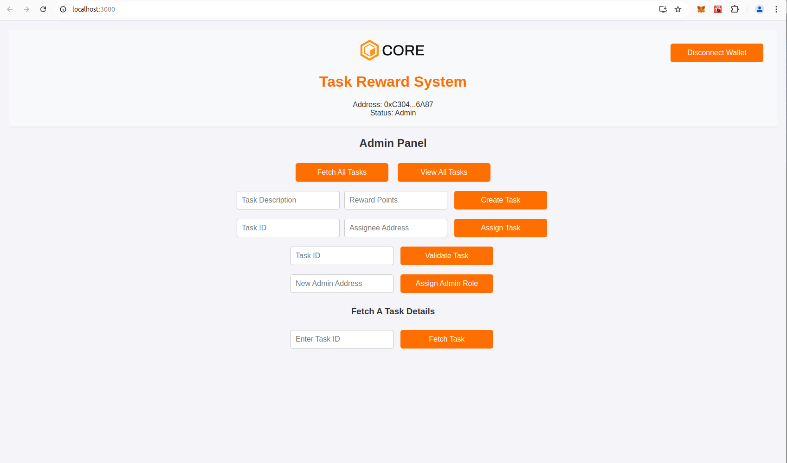

# TaskVault-Incentive-Dapp


**TaskVault-Incentive-Dapp** is a decentralized application (DApp) that enables admins to create tasks, assign rewards, and allow users to claim, complete, and get rewarded for completing tasks. Built on the Core blockchain, it integrates Web3 functionality through MetaMask to enable secure user transactions with smart contracts deployed on the Core network.

## Table of Contents
- [What is TaskVault-Incentive-Dapp?](#what-is-taskvault-incentive-dapp)
- [Learning Takeaways](#learning-takeaways)
- [Tech Stack](#tech-stack)
- [Installation](#installation)
  - [Clone the Repository](#clone-the-repository)
  - [Backend Setup (Smart Contracts)](#backend-setup-smart-contracts)
  - [Frontend Setup](#frontend-setup)
- [Software Prerequisites](#software-prerequisites)
- [Setting up the Development Environment](#setting-up-the-development-environment)
- [Smart Contract Functions](#smart-contract-functions)
- [How to Interact with the DApp](#how-to-interact-with-the-dapp)
- [How to Deploy](#how-to-deploy)
- [Key Functionalities](#key-functionalities)
- [Git Ignore Secrets](#git-ignore-secrets)

## What is TaskVault-Incentive-Dapp?

TaskVault-Incentive-Dapp is a decentralized application that allows:
- **Admins** to create tasks with descriptions and rewards.
- **Users** to claim tasks, mark them as completed, and receive rewards once validated by an admin.
  
The DApp interacts with smart contracts on the Core blockchain, providing transparency and decentralization for task management, validation, and reward distribution. All transactions (task claims, completions, and validations) are recorded on the blockchain, ensuring accountability.

## Learning Takeaways

This project will help you:
- **Understand Smart Contracts**: Learn how to write and deploy smart contracts using Solidity and Hardhat.
- **Develop a Blockchain Frontend**: Create a React-based frontend that interacts with the Core blockchain via Ethers.js.
- **Integrate MetaMask**: Use MetaMask for secure interactions with smart contracts.
- **Explore Web3 Libraries**: Learn how to use Ethers.js for reading and writing to smart contracts.
- **Work with Decentralized Applications (DApps)**: Understand how DApps function by connecting frontend components with blockchain smart contracts.

## Tech Stack

- **Smart Contracts**: Solidity, OpenZeppelin, Hardhat
- **Frontend**: React.js, Ethers.js, Web3 React, RainbowKit
- **Blockchain Interaction**: MetaMask, Ethers.js

## Installation

### Clone the Repository

Start by cloning the project to your local machine:

```bash
git clone https://github.com/harystyleseze/dapp-tutorial.git
cd dapp-tutorial
```

### Backend Setup (Smart Contracts)

1. **Install dependencies**: Navigate to the backend directory and install the necessary dependencies.

   ```bash
   cd 11-TaskVault-Incentive-Dapp
   npm install
   ```

2. **Compile the smart contracts**: 

   ```bash
   npx hardhat compile
   ```

3. **Deploy the smart contracts**: Modify the `hardhat.config.js` to match your Core Testnet credentials and deploy using the following command:

   ```bash
   npx hardhat run scripts/deploy.js
   ```

### Frontend Setup

1. **Install frontend dependencies**: Go to the frontend directory and install the required dependencies.

   ```bash
   cd frontend
   npm install
   ```

2. **Start the development server**:

   ```bash
   npm run start
   ```

   The app will now be accessible at [http://localhost:3000](http://localhost:3000).

## Software Prerequisites

Before you begin, ensure the following software is installed:

- [Git](https://git-scm.com/) v2.44.0
- [Node.js](https://nodejs.org/en) v20.11.1
- [npm](https://docs.npmjs.com/downloading-and-installing-node-js-and-npm) v10.2.4
- [Hardhat](https://hardhat.org/hardhat-runner/docs/getting-started#installation) v2.22.6
- [MetaMask Extension](https://metamask.io/download/) (Chrome Extension)

### Core Testnet Configuration

Configure MetaMask to connect to the Core Testnet using the following details:
- **Network Name**: Core Testnet
- **New RPC URL**: `https://rpc.test.btcs.network`
- **Chain ID**: `1115`
- **Currency Symbol**: `CORE`

For more details, refer to the [Core Testnet Guide](https://docs.coredao.org/docs/Dev-Guide/core-testnet-wallet-config#adding-core-testnet-to-metamask).

### Core Faucet

To get test CORE tokens for transactions, visit the [Core Faucet](https://scan.test.btcs.network/faucet).

## Setting up the Development Environment

1. **Install MetaMask**: Install and configure the MetaMask extension for your browser. You can follow the installation guide [here](https://docs.coredao.org/docs/Dev-Guide/core-testnet-wallet-config).

2. **Create a `secret.json` File**: Store your sensitive private keys securely. This file will be used for deploying contracts and signing transactions. **Do not upload this file to version control**.

   Example of a `secret.json` structure:

   ```json
   {
     "DeployerPrivateKey": "your_deployer_private_key",
     "AssigneePrivateKey": "your_assignee_private_key"
   }
   ```

## Smart Contract Functions

Key functions in the smart contract:

1. **createTask(description, rewardPoints)**: Allows admins to create tasks with descriptions and reward points.
2. **claimTask(taskId)**: Users can claim tasks that are not yet assigned.
3. **completeTask(taskId)**: Users mark a task as completed once they finish it.
4. **validateTask(taskId)**: Admins validate task completion and release rewards.
5. **viewTaskStatus(taskId)**: Anyone can view the task status (claimed, completed, validated).

## How to Interact with the DApp

1. **Connect Wallet**: Users must connect their MetaMask wallet to interact with the DApp.
2. **Admin Role**: Only admins can create tasks, assign them, and validate completions.
3. **UserAssignee Role**: Users can claim tasks, mark them as completed, and request validation for rewards.

## How to Deploy

1. **Modify Deployment Script**: Edit `scripts/deploy.js` with your contract details.
2. **Deploy Contracts**:

   ```bash
   npx hardhat run scripts/deploy.js
   ```

## Key Functionalities

- **Task Creation**: Admins create tasks with rewards.
- **Task Claiming**: Users can claim tasks if not already claimed.
- **Task Completion**: Users mark tasks as completed after performing them.
- **Task Validation**: Admins validate task completion and issue rewards.

## Git Ignore Secrets

To prevent sensitive data from being exposed, add your `secret.json` to `.gitignore`:

```bash
# Ignore secret file containing sensitive private keys
secret.json
```
