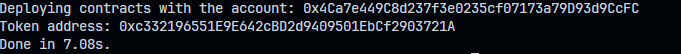
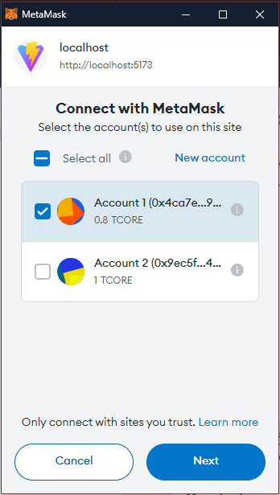
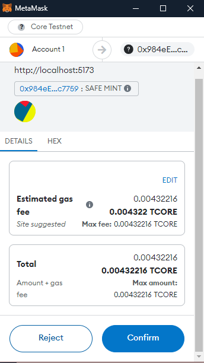
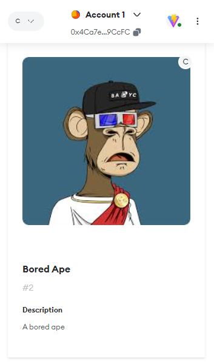

# Building NFT Minting DApp on Core

Welcome to this tutorial where we will build a simple NFT Minting DApp on Core Blockchain from scratch. We will make a basic DApp where you will be able to mint NFTs from the frontend app. By the end of the tutorial, we will have a functional dapp that interacts with smart contracts on the Core Blockchain Testnet. Let’s start🙌

## Learning Takeaways

- Smart Contract Development in Solidity programming language
- Building frontend using React.js
- Using Ethers.js library for interaction of frontend with smart contracts
- Integrating Metamask wallet for secure user transactions
- Read and write data to/from smart contracts

## Software Prerequisites

- [Git](https://git-scm.com/)
- [Node.js](https://nodejs.org/en) v20.13.1
- [Yarn](https://yarnpkg.com/) v1.22.21
- [Hardhat](https://hardhat.org/) v2.20.1
- [Metamask Wallet](https://metamask.io/download/)
- **Core Testnet Configuration**: Configure MetaMask to connect to the Core Testnet. Refer here for more details.
  - **Network Name**: Core Testnet
  - **New RPC URL**: [https://rpc.test.btcs.network](https://rpc.test.btcs.network)
  - **Chain ID**: 1115
  - **Currency Symbol**: CORE
- **Core Faucet**: To get test CORE tokens for transactions, visit the Core Faucet, refer [here](https://docs.coredao.org/docs/Dev-Guide/core-faucet) for more details.

## Setting up Dev Environment

### 1. Initialize the project

We will create a new director `NFT_Minting` and initialize our project using `yarn`.

```bash
mkdir NFT_Minting
cd NFT_Minting
yarn init -y
yarn add --dev hardhat
yard hardhat init
```


Select the `Create a Javascript project`
Select the default project root directory
Select yes adding a `.gitignore` and installing additional packages

### 2. Install and Configure MetaMask

- Install and configure MetaMask Chrome Extension to use with Core Testnet.
- Refer [here](https://docs.coredao.org/docs/Dev-Guide/core-testnet-wallet-config) for a detailed guide.

### 3. Create a Secret File

- Create a `secret.json` file in the root folder and store the private key of your MetaMask wallet in it.
- Refer [here](https://metamask.zendesk.com/hc/en-us/articles/360015290032-How-to-reveal-your-Secret-Recovery-Phrase) for details on how to get MetaMask account's private key.

```json
{
  "PrivateKey": "you private key, do not leak this file, do keep it absolutely safe"
}
```

### 4. Update .gitignore

- Update your .gitignore file to ensure that your secret.json file and other sensitive files are not committed to version control.
- Make sure to add `secret.json` to the `.gitignore` file.

### 5. Update the `hardhat.config.js` file

Replace the contents of `hardhat.config.js` file with the following code. Make sure that the configuration for Core Testnet are set correctly.

```javascript
require("@nomicfoundation/hardhat-toolbox");
const { PrivateKey } = require("./secret.json");

/** @type import('hardhat/config').HardhatUserConfig */
module.exports = {
  solidity: "0.8.24",
  defaultNetwork: "core_testnet",

  networks: {
    hardhat: {},
    core_testnet: {
      url: "https://rpc.test.btcs.network",
      accounts: [PrivateKey],
      chainId: 1115,
    },
  },
  solidity: {
    compilers: [
      {
        version: "0.8.24",
        settings: {
          evmVersion: "paris",
          optimizer: {
            enabled: true,
            runs: 200,
          },
        },
      },
    ],
  },
  paths: {
    sources: "./contracts",
    cache: "./cache",
    artifacts: "./artifacts",
  },
  mocha: {
    timeout: 20000,
  },
};
```

Your folder structure should look something like this.


## Writing smart contracts

Awsome! Now lets jump in the exciting stuff and start writing our smart contracts. Go to the `contracts` folder and create a new file with the name `MyNFT.sol`.
But before writing any code, we need to install the `@openzeppelin/contracts` library to implement our NFT smart contracts. Download it by running this command:

```bash
yarn add @openzeppelin/contracts
```

After the download completes we can write our smart contract:

```js
// SPDX-License-Identifier: UNLICENSED
pragma solidity ^0.8.24;

import "@openzeppelin/contracts/token/ERC721/ERC721.sol";
import "@openzeppelin/contracts/token/ERC721/extensions/ERC721URIStorage.sol";
import "@openzeppelin/contracts/access/Ownable.sol";

contract Nft is ERC721, ERC721URIStorage, Ownable {
    uint256 private _nextTokenId;

    constructor() ERC721("MyNFT", "MYN") Ownable(msg.sender) {}

    function safeMint(address to, string memory uri) public onlyOwner {
        uint256 tokenId = _nextTokenId++;
        _safeMint(to, tokenId);
        _setTokenURI(tokenId, uri);
    }

    // The following functions are overrides required by Solidity.

    function tokenURI(
        uint256 tokenId
    ) public view override(ERC721, ERC721URIStorage) returns (string memory) {
        return super.tokenURI(tokenId);
    }

    function supportsInterface(
        bytes4 interfaceId
    ) public view override(ERC721, ERC721URIStorage) returns (bool) {
        return super.supportsInterface(interfaceId);
    }
}
```

In this code, we

- Import the `ERC721`, `ERC721URIStorage`, and `Ownable` classes from the openzeppelin/contracts library for creating a new NFT smart contract.
- Initialize a private state variable `_nextTokenId` to store the ID of the NFT.
- The constructor initializes the ERC721 contract with a name and symbol, and sets up the `Ownable` contract with the owner's address to restrict NFT minting to the owner.
- The `safeMint` function mints a new NFT, taking the recipient's address and the NFT's URI as arguments.
- The `tokenURI` and `supportsInterface` functions override required methods from `ERC721` and `ERC721URIStorage`.

In the `safeMint` function, we

- Increment the `_nextTokenId` variable to get the next token ID.
- Mint the NFT to the user using the `_safeMint` function.
- Set the URI of the NFT using the `_setTokenURI` function. The uri is the metadata of the NFT, which holds the image, name, and other details of the NFT.

## Compiling and Deploying the Smart Contract

Great, Now run the following command to complie the contract

```bash
yarn hardhat compile
```

If the compilation is successful, you should see something like this:


Now let us deploy the smart contract to the Core Testnet. For this, create a new folder in your root directory and name it `scripts`. Inside the `scripts` folder, create a new file named `deploy.js` and write the following code:

```js
const { ethers } = require("hardhat");

async function main() {
  const [deployer] = await ethers.getSigners();

  console.log("Deploying contracts with the account:", deployer.address);

  const MyNFT = await ethers.getContractFactory("MyNFT");
  const myNft = await MyNFT.deploy();

  console.log("Token address:", await myNft.getAddress());
}

main()
  .then(() => process.exit(0))
  .catch((error) => {
    console.error(error);
    process.exit(1);
  });
```

Make sure your metamask wallet has tCORE testnet tokens to deploy the contract. If not, visit the [Core Faucet](https://scan.test.btcs.network/faucet) to get some testnet CORE tokens.

Great! Now run the following command in the root directory of your project to deploy the smart contract:

```bash
yarn hardhat run scripts/deploy.js
```

If the deployment is successful, you should see the address of the deployed contract in the console.



Make sure to save this address as we will need it later to interact with the smart contract.

## Building the Frontend

Awsome! We have deployed our smart contract to the Core Testnet. Now let's build the frontend of our DApp. We will use **Vite** and **React** to build our frontend. Go to the root directory of your project and run the following command:

```bash
yarn create vite frontend
```


Select **React** from the `Select a framework` option and **Javascript** from `Select a variant` option.

Now we will use the **Ethers.js** library to interact with our smart contracts. Install it in the frontend directory.

```bash
yarn add ethers
```

To interact with the smart contract, we also need the ABI (Application Binary Interface) along with address of the deployed contract. We can get the ABI from the `artifacts` folder in the root directory of the project. Create a new directory in the `src` folder, name it `abis` and create a new file `MyNFTAbi.json` . Now copy the ABI of the `MyNFT` contract and paste it in the `MyNFTAbi.json` file.

Excellent, now let's write code to connect our metamask wallet in the `App.jsx` file.

```javascript
import { useEffect, useState } from "react";
import { ethers } from "ethers";
import MyNFTAbi from "./abis/MyNFTAbi.json";
import "./App.css";

function App() {
  const [walletAddress, setWalletAddress] = useState();
  const [provider, setProvider] = useState();
  const [signer, setSigner] = useState();

  const contractAddress = "0x984eE96FE316006533c0BB78c97e3A02E41c7759"; // Replace contract address
  const abi = MyNFTAbi.abi;

  async function connectWallet() {
    const { ethereum } = window;
    if (!ethereum) {
      alert("Please install MetaMask!");
      return;
    }

    try {
      const provider = new ethers.BrowserProvider(ethereum);
      const [account] = await ethereum.request({
        method: "eth_requestAccounts",
      });
      const signer = provider.getSigner();

      setProvider(provider);
      setSigner(signer);
      setWalletAddress(account);
    } catch (error) {
      console.log("Error fetching network:", error);
    }
  }
  useEffect(() => {
    connectWallet();
  }, []);

  return (
    <>
      <h1>NFT Minting Dapp</h1>
      {walletAddress ? (
        <p>
          Connected Address: <strong>{walletAddress}</strong>
        </p>
      ) : (
        <button onClick={connectWallet}>Connect Wallet</button>
      )}
    </>
  );
}

export default App;
```

Now run `yarn dev` command in the frontend directory, open the app in your browser on `http://localhost:5173`. You should see your metamaks wallet prompt you to connect to the website.



Make sure to connect that account only which you have used to deploy the contract. Since we have used the `Ownable` class in our contract, we will face errors if we try to mint the NFT in other accounts. By clicking `Next` and `Confirm`, our wallet will be connected to the website and we will see our address on the screen.


Wonderful! Now we will write code to show the nft image and mint it in our wallet.
We will also add code to show our NFT image and button to mint in our wallet

```javascript
const nftImage = "https://raw.githubusercontent.com/GM-11/NFT_Minting_Tutorial_Core/main/assets/nft.png"

const nftUri = "https://raw.githubusercontent.com/GM-11/NFT_Minting_Tutorial_Core/main/assets/metadata.json"

```

For this tutorial, you can copy these links as it is.

```javascript
<h1>NFT Minting Dapp</h1>;
{
  walletAddress ? (
    <section className="nft-section">
      <p>
        Connected Address: <strong>{walletAddress}</strong>
      </p>

      
      <br />
      <button>Mint this NFT</button>
    </section>
  ) : (
    <button onClick={connectWallet}>Connect Wallet</button>
  );
}
```

Now our app will look something like this


Now let's make a function to mint our NFT in our MetaMask wallet.

```javascript
async function mintNFT() {
  try {
    const contract = new ethers.Contract(contractAddress, abi, signer);
    const tx = await contract.safeMint(walletAddress, nftUri);
    await tx.wait();
  } catch (error) {
    console.log("Error minting NFT:", error);
  }
}
```

In this function, we are

- Creating a new instance of the contract using the contract address and ABI.
- Calling the `safeMint` function of the contract to mint the NFT. The `safeMint` function takes two arguments, the address of the user to whom the NFT will be minted and the URI of the NFT.
- Waiting for the transaction to be confirmed and then showing an alert that the NFT has been minted successfully.

Now let's call this function when the user clicks the mint button.

```javascript
<button onClick={mintNFT}>Mint this NFT</button>
```

When we click the `**Mint this NFT** button, our wallet should prompt us to sign the transaction



Click on **Confirm** to confirm the transaction.

Awsome! We have minted our first NFT on the Core Blockchain!🥳

But wait, why can't we see it?🤔


Well since this NFT is on the testnet, metamask automatically does not detect them. We need to import our NFT into our wallet.

Cick on `Import NFT` at the bottom. Add your contract address in the **Address** input field and 0 in the **Token Id** input field and click on **Import**.



Wonderful, now we can see our nft in the wallet!

## Conclusion

🎉🙌Congratulations, you have created a basic NFT Minting DApp on the Core Testnet.
